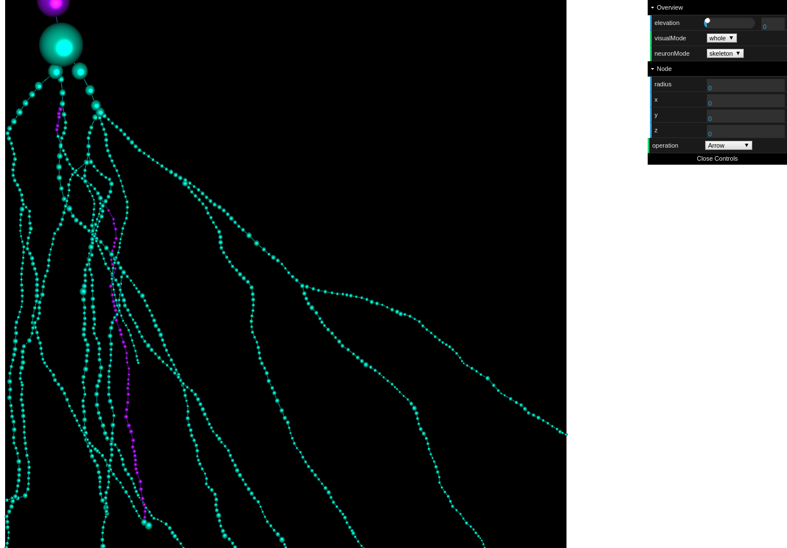
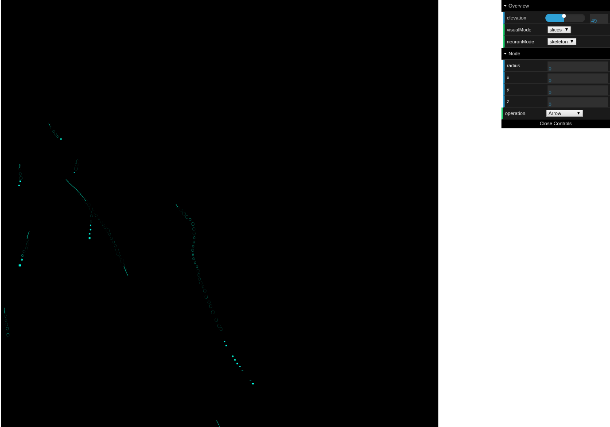
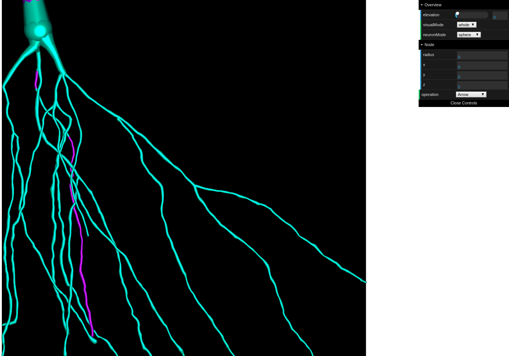
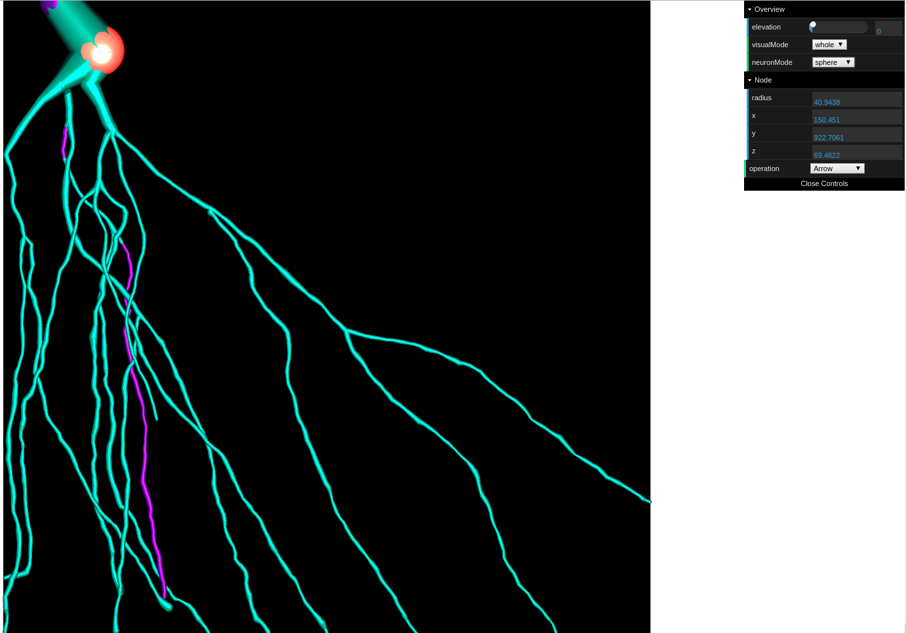
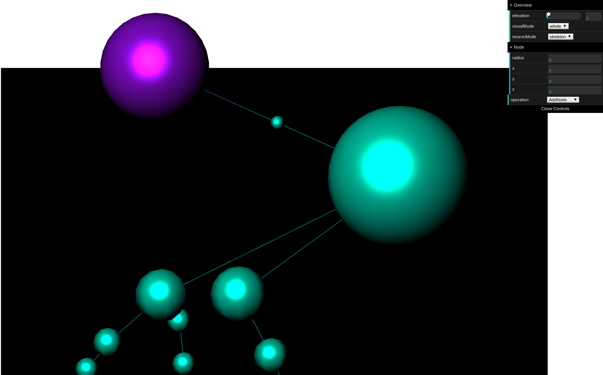
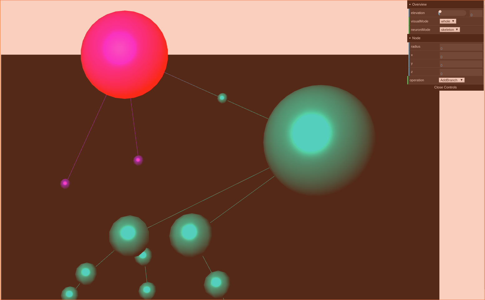
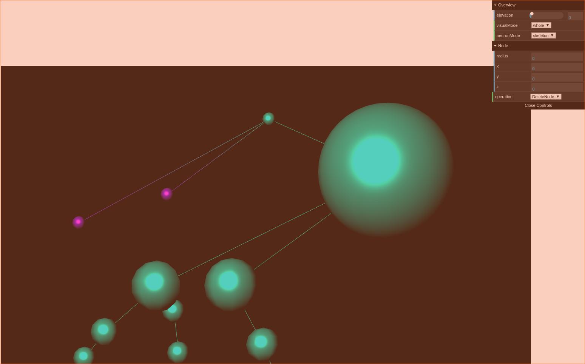

# Overview
Welcome to the Hatu wiki! Hatu is a neuron image reconstruction and visualization project. So far, we have supported swc visualization and edit.

# dependencies
`Hatu` depends on `divd` and `postgres`. If you has these dependencies, you just need to set config in `./scripts/default_environment` to make sure that `divd` can connect to these dependencies.
If you do not has these dependencies, you can run `./scripts/run_dependencies.sh` to start up them in docker.

# Run
`npm start`

# Test
`npm run test`

#Visualization Mode

* Whole  
In this mode, we could observe whole neuron structure and conduct operation.

* Slice  
Once the `Slice` mode is applied, we could use slide bar to control which slice is visualized. The `HatuViewer` would visualized the structure between -1 and +1 around the chosen slice.

#Neuron Mode
The `Hatu` provide two different visualization modes for neuron structure.

* Skeleton  
Under `Skeleton` mode, the edge between two neuron node would be a line.

* Sphere  
And `Sphere` mode would visualize it as a cylinder.

#Operation
Four basic operations are supported. You could use `right click` to drag the canvas and `left click` to select node. Besides, The `mouse wheel` could be used to zoom the view. 

* **Arrow**     
  The `Arrow` operation allow user to select node and modify its position and radius. In addition, all property could be edited in the `window` on the right.

* **Add Node**  
  We could `Add Node` by click a edge between two nodes. The node would appear in the center of the edge. You could adjust it position under `Arrow` operation.
  

* **Add Branch**    
  If we need `Add Branch`, we shall choose a parent by click and click on  the position you want.
  

* **Delete Node**  
  Switch the `operation` to `Delete Node` and click a node. The chosen node would be removed. Note that the root node couldn't be deleted for now.
  

# Tips
1. *Chrome* is recommended.
2. Test mechanism and CI should be integrated.
